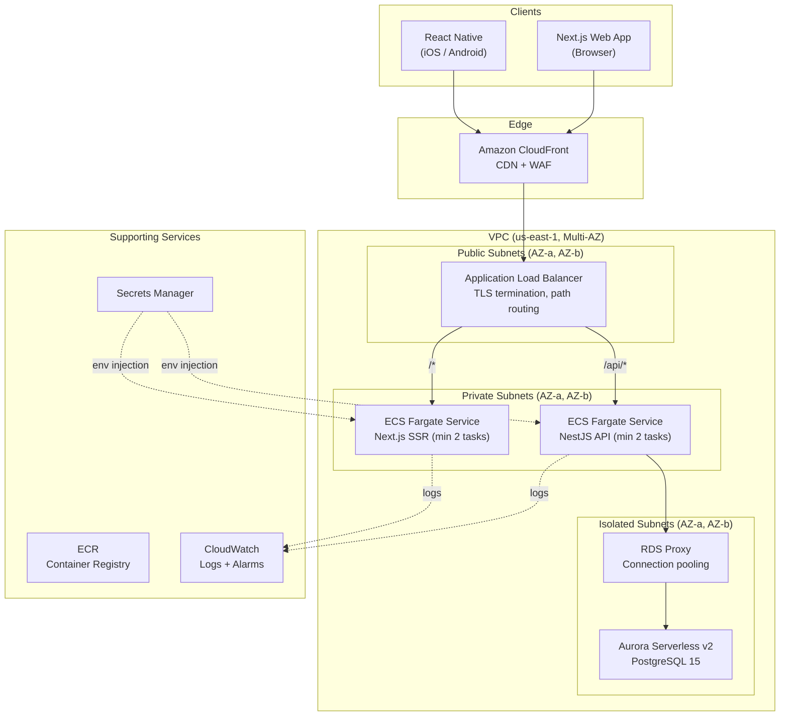

# TeamSync — AWS Production Architecture

> This document describes how TeamSync (NestJS API, Next.js web app, React Native mobile app) would be deployed, secured, and operated in production on AWS. **No real AWS resources have been provisioned.**

---

## 1. High-Level Architecture



---

## 2. Component Deployment Strategy

### A. Backend API — ECS Fargate

| Decision | Choice | Rationale |
|---|---|---|
| Compute | **ECS Fargate** | Serverless containers — no EC2 patching, no AMI management. Tasks run in isolated VMs (Firecracker), providing strong workload isolation. |
| Alternative rejected | Lambda | The NestJS API has a persistent Prisma connection pool and non-trivial cold-start (~2–3s with Prisma engine). Lambda's per-request cold starts and 15-min execution limit make it a poor fit for a stateful REST API. Fargate keeps containers warm with near-zero cold start. |
| Networking | Private subnets only | API containers have no public IP. All inbound traffic routes through the ALB, which terminates TLS and enforces security group rules. Outbound traffic to AWS services uses VPC endpoints (ECR, Secrets Manager, CloudWatch) — no NAT Gateway cost. |
| Scaling | Target-tracking auto-scaling | Scale on `ECSServiceAverageCPUUtilization > 60%` with a minimum of 2 tasks (one per AZ) for high availability. Max 10 tasks. Scale-in cooldown of 300s prevents thrashing. |
| Health check | ALB target group | `GET /api/health` returns 200; unhealthy tasks are drained and replaced automatically. |

### B. Database — Aurora Serverless v2

| Decision | Choice | Rationale |
|---|---|---|
| Engine | **Aurora Serverless v2 (PostgreSQL 15)** | Auto-scales compute (ACUs) from 0.5 to 128 in sub-second increments. During low-traffic periods (nights, weekends), cost drops to ~$0.12/ACU-hour. During peak planning sessions, capacity scales silently with no connection drops. |
| Alternative rejected | Standard RDS | Requires pre-provisioned instance sizes. Over-provisioning wastes cost; under-provisioning causes outages during traffic spikes. Aurora Serverless v2 eliminates this guessing game. |
| High availability | Multi-AZ | Aurora replicates storage across 3 AZs with 6 copies of data. Automated failover completes in < 30s. Continuous backups to S3 with point-in-time recovery (up to 35 days). |
| Connection pooling | **RDS Proxy** | Prisma Client opens a connection pool per container instance (`connection_limit` in the connection URL). With 10 Fargate tasks × 10 connections each = 100 simultaneous connections. RDS Proxy multiplexes these into a smaller pool (~20–30 actual database connections), preventing connection exhaustion during scale-out events. |

### C. Web Application — ECS Fargate (behind CloudFront)

| Decision | Choice | Rationale |
|---|---|---|
| Hosting | **ECS Fargate** (behind CloudFront) | The Next.js app uses App Router with SSR, API routes (for auth proxy), and dynamic rendering. A full Node.js runtime is required — S3 static hosting alone cannot serve SSR pages. |
| Alternative considered | AWS Amplify Hosting | Amplify supports Next.js SSR, but its abstraction limits control over VPC networking (the Next.js API routes need to reach the backend API in private subnets). ECS provides full networking control. |
| CDN | **CloudFront** | Caches static assets (`/_next/static/*`) at 450+ edge locations globally. Dynamic SSR responses pass through with `Cache-Control: no-store`. WAF integration provides rate limiting and bot protection. |
| Path routing | ALB path-based rules | `/api/*` → NestJS API service; `/*` → Next.js SSR service. Single ALB, single domain, no CORS complexity. |

### D. Mobile App — Expo Application Services (EAS)

| Decision | Choice | Rationale |
|---|---|---|
| Build | **EAS Build** | Produces signed `.ipa` (iOS) and `.aab` (Android) binaries in the cloud. No local Xcode/Android Studio build environment required for CI. |
| Distribution | Apple App Store + Google Play | Standard app store distribution for production users. Internal testing via TestFlight (iOS) and Play Console internal track (Android). |
| OTA updates | **EAS Update** | Push JavaScript bundle updates (bug fixes, UI changes) over-the-air without app store review delays. Critical for rapid incident response. |
| API endpoint | CloudFront domain | Mobile app hits the same CloudFront → ALB → ECS API path as the web app. No separate API endpoint needed. |

---

## 3. Secrets Management

**Principle:** Secrets never appear in source code, environment files, CI logs, or container images.

### Implementation

```
┌──────────────────────────┐
│  AWS Secrets Manager     │
│                          │
│  /prod/teamsync/db-url   │──── DATABASE_URL
│  /prod/teamsync/jwt-keys │──── JWT_ACCESS_SECRET, JWT_REFRESH_SECRET
│  /prod/teamsync/app      │──── CORS_ORIGIN, API_URL
└──────────────────────────┘
         │
         │  ECS Task Definition references secrets by ARN
         │  (valueFrom: arn:aws:secretsmanager:...)
         ▼
┌──────────────────────────┐
│  ECS Fargate Container   │
│                          │
│  process.env.DATABASE_URL = "postgres://..."  (in memory only)
│  process.env.JWT_ACCESS_SECRET = "..."        (never logged)
└──────────────────────────┘
```

**Workflow:**
1. Secrets are created in Secrets Manager with automatic rotation enabled (30-day rotation for database credentials via Lambda rotator).
2. The ECS Task Definition declares secrets as `valueFrom` references — the secret value is fetched at container start and injected as an environment variable.
3. IAM policies restrict secret access to the specific ECS task execution role (`ecsTaskExecutionRole`). No other principal can read the secrets.
4. **Audit trail**: Every secret access is logged in CloudTrail, enabling forensic analysis if a secret is accessed outside normal deployment patterns.

**CI/CD secrets**: GitHub Actions secrets (e.g., `AWS_ACCESS_KEY_ID`) are stored in GitHub's encrypted secrets store and injected as environment variables during workflow runs. These are OIDC-federated where possible to avoid long-lived credentials entirely.

---

## 4. CI/CD Pipeline — GitHub Actions

```mermaid
graph LR
    subgraph PR["Pull Request"]
        Lint["Lint<br/>(ESLint)"]
        Test["Unit Tests<br/>(Jest)"]
        Audit["Security Audit<br/>(npm audit)"]
        Build["Build Check<br/>(tsc + next build)"]
    end

    subgraph Merge["Merge to main"]
        Docker["Docker Build<br/>(multi-stage)"]
        Push["Push to ECR<br/>(tagged: sha-abc1234)"]
    end

    subgraph Deploy["Production Deploy"]
        Migrate["DB Migration<br/>(one-off ECS task)"]
        Update["ECS Rolling Update<br/>(zero-downtime)"]
        Smoke["Smoke Tests<br/>(health + critical paths)"]
    end

    Lint --> Test --> Audit --> Build
    Build -->|"all pass"| Docker --> Push
    Push -->|"image pushed"| Migrate --> Update --> Smoke
```



### Stage 1: Validate (on every PR to `main`)

```yaml
# Runs in parallel for fast feedback (~2 min)
- npm run lint           # ESLint with strict rules
- npm run test -- --ci   # Jest with coverage threshold (80%)
- npm audit --audit-level=high  # Fail on high/critical CVEs
- npm run build          # Verify TypeScript compilation + Next.js build
```

All four checks must pass before a PR can be merged. Branch protection rules enforce this.

### Stage 2: Build & Push (on merge to `main`)

```yaml
- docker build --target production -t $ECR_REPO:$GITHUB_SHA .
- aws ecr get-login-password | docker login --username AWS --password-stdin $ECR_REPO
- docker push $ECR_REPO:$GITHUB_SHA
```

Multi-stage Docker build produces a slim production image (~150MB) with only runtime dependencies. The image is tagged with the commit SHA for exact traceability.

### Stage 3: Deploy (triggered after ECR push)

1. **Database migration** (blocking, must succeed):
   ```yaml
   # Run as a one-off ECS task (not the long-running service)
   aws ecs run-task --task-definition teamsync-migrate --command "npx prisma migrate deploy"
   ```
   Migrations run before the API containers update, ensuring the database schema is always forward-compatible.

2. **Rolling deployment** (zero-downtime):
   ```yaml
   aws ecs update-service --service teamsync-api --force-new-deployment
   ```
   ECS performs a rolling update: new tasks start and pass health checks before old tasks are drained. The ALB shifts traffic gradually, ensuring zero dropped requests.

3. **Post-deploy smoke tests**:
   ```yaml
   curl -f https://api.teamsync.example.com/api/health
   # Optionally: run a lightweight integration test suite against the live API
   ```

### Rollback Strategy

If smoke tests fail or monitoring detects elevated error rates:
- **Immediate**: Redeploy the previous ECR image tag (`aws ecs update-service --task-definition teamsync-api:<previous-revision>`).
- **Database**: Migrations are designed to be backward-compatible (additive-only). Destructive changes (column drops, renames) are deferred to a subsequent release after the old code is fully drained.

---

## 5. Scaling Concern: Task Query Degradation Under Load

### The Problem

As TeamSync grows, the `Task` table becomes the system's hot table. Consider a mid-scale deployment:

| Metric | Value |
|---|---|
| Total tasks | 1,000,000+ |
| Concurrent dashboard users | 500 |
| Dashboard refreshes/minute | 1,500 (each triggers `GET /projects/:id/tasks`) |
| Task mutations/minute | 50 (creates, status updates) |

The read-to-write ratio is **30:1**, making this a read-heavy workload. Without mitigation, two failure modes emerge:

1. **Query latency spike**: Without proper indexing, filtering 1M rows by `projectId + status + assigneeId` and sorting by `dueDate` triggers a sequential scan (~800ms–3s). At 1,500 requests/minute, this saturates database CPU within minutes.

2. **Connection exhaustion**: 10 auto-scaled Fargate tasks × 10 Prisma connections each = 100 connections hitting PostgreSQL's default `max_connections` limit (typically 100–200 for small-medium instances). New API requests queue and eventually timeout.

### Mitigation Strategy

**Layer 1 — Composite Index (Already Applied)**

The schema includes a composite B-Tree index specifically designed for the dashboard query:

```prisma
@@index([projectId, status, assigneeId, dueDate])
```

This reduces the query from a sequential scan of 1M rows to an index scan of ~50–200 rows, dropping latency from seconds to sub-5ms. The trailing `dueDate` column eliminates the separate sort phase entirely.

**Layer 2 — RDS Proxy (Connection Pooling)**

RDS Proxy sits between the Fargate tasks and Aurora, multiplexing 100+ application connections into ~20–30 database connections. This decouples API horizontal scaling from database connection limits. Even with 20 Fargate tasks, the database sees a stable, bounded connection count.

**Layer 3 — Aurora Read Replicas (Read/Write Splitting)**

For sustained high read volume, configure an Aurora Reader endpoint:

```
Writer endpoint → POST /tasks, PATCH /tasks, POST /comments
Reader endpoint → GET /projects/:id/tasks, GET /tasks/:id
```

At the application level, Prisma supports read replicas via the `datasourceUrl` override. Read queries are directed to the reader endpoint, distributing CPU load across multiple Aurora replicas. Aurora auto-scales reader instances based on CPU utilization.

**Layer 4 — Response Caching (Future)**

For project task lists that don't require real-time freshness, add a 10–30 second Redis (ElastiCache) cache in front of the database query. The cache key would be `tasks:{projectId}:{status}:{assigneeId}:{page}` with automatic invalidation on task mutations via RTK Query's tag-based invalidation pattern.

### Result

These four layers — composite indexing, connection pooling, read replicas, and optional response caching — ensure the system handles 10x traffic growth without architectural changes. Each layer addresses a specific bottleneck and can be enabled independently as traffic demands it.
