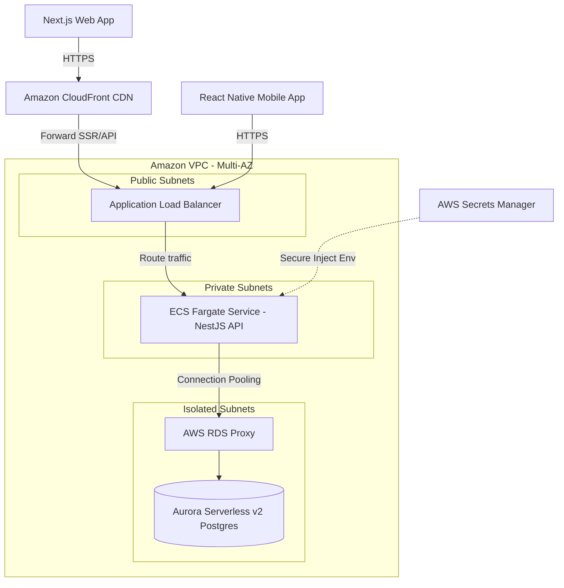

# TeamSync Cloud Architecture Design (AWS)

This document details the production cloud architecture design for **TeamSync**, showcasing how the platform (Backend NestJS API, Web Next.js application, and Mobile React Native companion app) is deployed, secured, and scaled using AWS services.

---

## 1. Production AWS Deployment Diagram & Service Selection



### A. Backend API (NestJS + Prisma)
* **AWS Service**: **AWS ECS (Elastic Container Service) on AWS Fargate**
* **Rationale**: 
  - **Serverless Containers**: Fargate removes the operational overhead of managing, scaling, and patching EC2 instances.
  - **Security**: ECS tasks run in private VPC subnets, shielded from the public internet. Access is restricted via an Application Load Balancer (ALB) in public subnets.
  - **Scaling**: Fast scale-up triggers based on CPU/Memory thresholds.

### B. Database (PostgreSQL)
* **AWS Service**: **Amazon Aurora Serverless v2 (Postgres-Compatible)**
* **Rationale**:
  - **Auto-Scaling Compute**: Aurora scales capacity (ACUs) instantly from 0.5 to 128+ dynamically, handling peak task-planning hours without overprovisioning.
  - **High Availability**: Multi-AZ deployments with automated failover and continuous incremental backups stored in S3.
  - **Connection Management**: Pair with **AWS RDS Proxy** to buffer database connections. Prisma establishes many concurrent connections, and RDS Proxy prevents connection exhaustion under high API load.

### C. Web Application (Next.js App Router)
* **AWS Service**: **AWS Amplify Hosting** (Alternative: **ECS Fargate**)
* **Rationale**:
  - Next.js App Router uses hybrid rendering (SSR, ISR, static page generation). AWS Amplify Hosting supports Next.js Server-Side Rendering natively by provisioning CloudFront CDNs coupled with AWS Lambda/Fargate computing.
  - Automates branch deployments, SSL certificate provision, and static asset caching.

### D. Mobile Companion App (React Native)
* **Distribution Strategy**: **Expo Application Services (EAS)**
  - Use **EAS Build** to compile production `.ipa` (iOS) and `.apk`/`.aab` (Android) binaries.
  - Distribute binaries to the Apple App Store and Google Play Store.
  - Use **EAS Update** to push hot-fixes and UI changes over-the-air (OTA) without requiring users to download a new App Store release.

---

## 2. Secrets Management Strategy

Never store plain-text secrets (database passwords, JWT private keys) in the source code or git history.
* **AWS Service**: **AWS Secrets Manager**
* **Workflow**:
  1. Secrets are created and stored securely in Secrets Manager (e.g., `/production/teamsync/secrets`).
  2. The ECS Task Definition references these secrets by ARN.
  3. During task initialization, AWS ECS automatically fetches the secret values and injects them as standard environment variables (`DATABASE_URL`, `JWT_ACCESS_SECRET`) directly into the container memory.
  4. The secrets are never printed to stdout, logged, or checked into CI configurations.

---

## 3. CI/CD Pipeline Blueprint (GitHub Actions)

We will use a declarative GitHub Actions workflow divided into progressive stages:

```
[PR Created] ──> [Stage 1: Validate] ──> [Stage 2: Build & Push] ──> [Stage 3: Deploy]
```

### Stage 1: Validate (Triggered on Pull Requests to `main`)
* Run eslint code analysis (`npm run lint`).
* Execute security audit checks (`npm audit`).
* Run full suite of Jest unit tests (`npm run test`).
* Build application to verify compilation completes successfully.

### Stage 2: Build & Push (Triggered on merges to `main`)
* Log into **AWS ECR (Elastic Container Registry)**.
* Build the optimized multi-stage Docker image tag (`backend/Dockerfile`).
* Push the built image to ECR tagged with the commit SHA.

### Stage 3: Deploy (Triggered on successful ECR push)
* Download the active ECS Task Definition.
* Update the task container image reference with the new ECR image tag.
* Register the new Task Definition in AWS ECS.
* Trigger a **rolling green-blue deployment** on the ECS Service (`aws ecs update-service --force-new-deployment`), ensuring zero-downtime updates.
* Execute DB migrations in a one-off ECS task (`npx prisma migrate deploy`) before updating the API containers.

---

## 4. Production Scaling Analysis

### The Scaling Concern: Connection Exhaustion & Complex Queries
As the `Task` table grows beyond 1M+ rows, and the user base increases:
1. **Connection Limits**: Prisma Client opens connection pools per server instance. In a serverless/containerized auto-scaled setup, scaling to 15 API containers can easily exhaust PostgreSQL's maximum connection limit (typically 100-200 on small instances).
2. **Query Degradation**: Queries filtering by `projectId`, `assigneeId`, and `status` will trigger full table scans, raising database CPU utilization to 100% and timing out API requests.

### Mitigation Strategies:
1. **AWS RDS Proxy**: Implement RDS Proxy between the API and database. It pools and shares connections, allowing thousands of concurrent API requests to share a small pool of database connections.
2. **Composite Database Indexing**:
   Apply a composite index on Task queries:
   ```prisma
   @@index([projectId, status, assigneeId, dueDate])
   ```
   This index matches the exact layout of the query criteria. The database engine executes an **Index Scan** directly on the sorted tree structure rather than scanning the table in memory, reducing query execution times from seconds to milliseconds.
3. **Read Replicas**: Configure Aurora Reader endpoints. Write operations (`POST /tasks`, `PATCH /tasks`) hit the primary instance, while read queries (`GET /projects/:id/tasks`) are routed to read replicas, distributing the CPU load.
