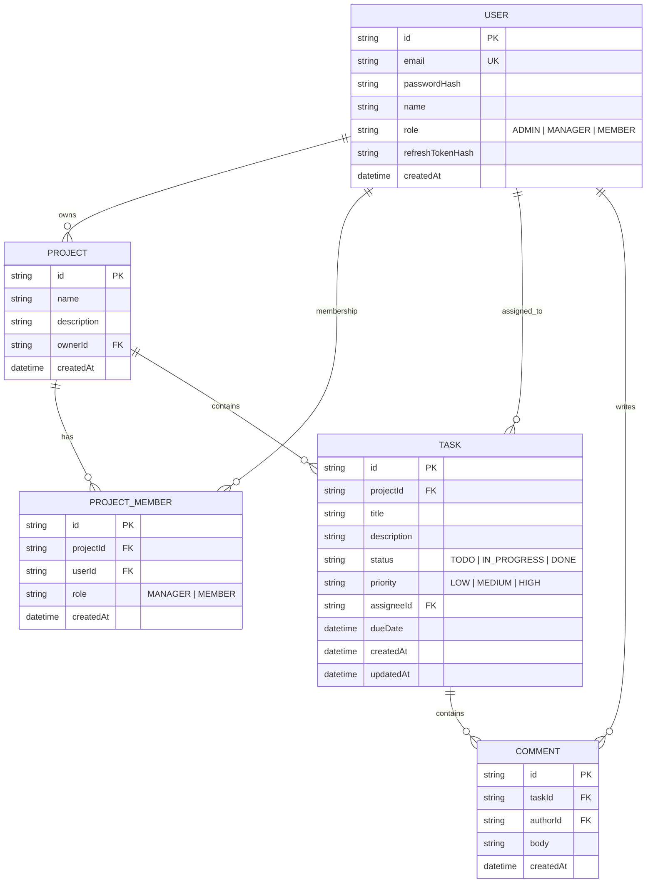

# TeamSync Platform

TeamSync is a lightweight project and task tracking platform consisting of a NestJS backend API, a Next.js web application dashboard, and a React Native (Expo) mobile companion application.

---

## 1. Local Setup Instructions

Follow these instructions to run the Backend API and PostgreSQL database locally using Docker.

### Prerequisites
- Install [Docker Desktop](https://www.docker.com/products/docker-desktop/) and ensure the Docker Daemon is running.
- Install [Node.js v20+](https://nodejs.org/) and NPM.

### Run the Stack via Docker Compose
From the root workspace directory, run:
```bash
docker compose up --build
```
This single command:
1. Spins up a PostgreSQL database instance.
2. Builds the multi-stage production Docker image for the NestJS API.
3. Applies database migrations automatically.
4. Seeds the database with test users, projects, tasks, and comments.
5. Exposes the API at `http://localhost:3000`.

### Access API Documentation (Swagger)
Open your browser and navigate to:
```
http://localhost:3000/api/docs
```
You can use the interactive Swagger interface to call endpoints. Authenticate using the bearer token returned from `/auth/login`.

### Run Unit Tests locally
To run Jest unit tests covering service logic and guards, navigate to the `backend` folder and run:
```bash
cd backend
npm run test
```

---

## 2. Part D — Database Design

### A. Entity Relationship Diagram (ERD)



### B. Indexing Analysis Note (Part D)

When the `Task` table grows to 1,000,000+ rows, running the project task query:
* Filters by: `projectId = ? AND status = ? AND assigneeId = ?`
* Sorts by: `dueDate ASC/DESC`

Without proper indexing, PostgreSQL is forced to perform a **Sequential Scan** (reading 1M rows from disk into memory), filter out non-matching rows, and execute an expensive **In-Memory Sort (QuickSort)** on the results. This results in high CPU utilization and seconds-long API latencies.

To optimize this, we add a **Composite Index** covering all four query columns:
```prisma
@@index([projectId, status, assigneeId, dueDate])
```

#### Why this index works:
1. **Left-to-Right Matching**: PostgreSQL indexes use B-Tree structures. The query provides exact match equality constraints (`=`) on the prefix columns: `projectId`, `status`, and `assigneeId`. The engine traverses the B-Tree directly to the matching subset, ignoring millions of non-matching records instantly.
2. **Eliminating the Sort Phase**: The index stores rows ordered by `dueDate` within each distinct combination of `(projectId, status, assigneeId)`. Because the index is already sorted, PostgreSQL can read the pointers sequentially in the exact order requested by `ORDER BY dueDate`. This eliminates the database **Sort** execution block entirely (saving memory and CPU).
3. **Index-Only / Bitmap Scans**: Instead of a heavy Heap Scan, the query executes as a high-speed Index Scan, yielding sub-millisecond response times.
