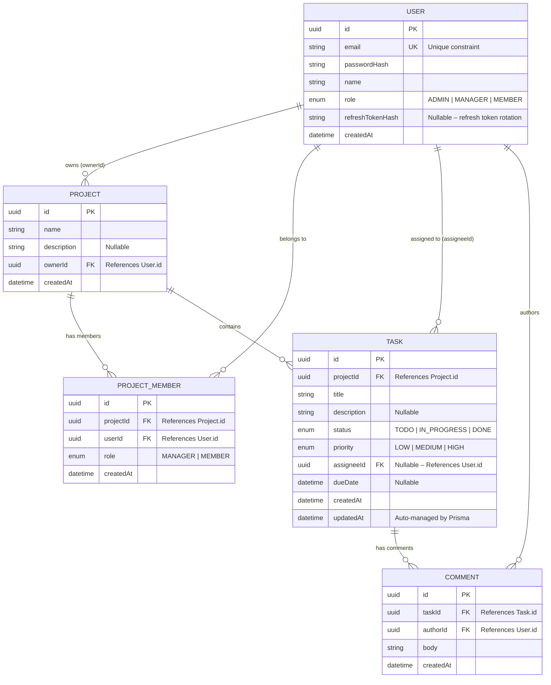

# TeamSync Platform

TeamSync is a lightweight project and task tracking platform consisting of a NestJS backend API, a Next.js web application dashboard, and a React Native (Expo) mobile companion application.

---

## 1. Local Setup Instructions

Follow these instructions to run the Backend API, Web App, and PostgreSQL database locally using Docker.

### Prerequisites
- Install [Docker Desktop](https://www.docker.com/products/docker-desktop/) and ensure the Docker Daemon is running.
- Install [Node.js v20+](https://nodejs.org/) and NPM.
- Install [Expo CLI](https://docs.expo.dev/get-started/installation/) for the mobile app (optional).

### Environment Configuration
1. Copy the root environment file:
   ```bash
   cp .env.example .env
   ```
2. The defaults in `.env.example` work out-of-the-box for local development. Replace the placeholder secrets with your own values for any non-local environment.

### Run the Stack via Docker Compose
From the root workspace directory, run:
```bash
docker compose up --build
```
This single command:
1. Spins up a PostgreSQL database instance.
2. Builds the multi-stage production Docker image for the NestJS API.
3. Builds the Next.js web application.
4. Applies database migrations automatically.
5. Seeds the database with test users, projects, tasks, and comments.
6. Exposes the API at `http://localhost:3000` and the Web App at `http://localhost:3001`.

### Seed Accounts (Pre-populated)

The seed script creates the following test accounts (password for all: **`password123`**):

| Email | Name | Global Role | Project Memberships |
|---|---|---|---|
| `admin@teamsync.com` | Super Admin User | ADMIN | _Bypasses all checks_ |
| `manager@teamsync.com` | Sarah Project Manager | MANAGER | Owner/Manager of both projects |
| `dev1@teamsync.com` | Alex Developer | MEMBER | Member of "TeamSync App Development" |
| `dev2@teamsync.com` | Jordan Designer | MEMBER | Member of both projects |

### Access API Documentation (Swagger)
Open your browser and navigate to:
```
http://localhost:3000/api/docs
```
You can use the interactive Swagger interface to call endpoints. Authenticate using the bearer token returned from `/auth/login`.

### Run the Mobile Companion App
The React Native (Expo) mobile app runs independently and connects to the same backend API.

1. Install dependencies:
   ```bash
   cd mobile
   npm install
   ```
2. Update the API base URL in `mobile/src/api/client.ts` if needed:
   - **iOS Simulator**: `http://localhost:3000` (works by default)
   - **Android Emulator**: `http://10.0.2.2:3000`
   - **Physical Device**: use your machine's LAN IP (e.g., `http://192.168.x.x:3000`)
3. Start the Expo development server:
   ```bash
   npx expo start
   ```
4. Scan the QR code with the Expo Go app on your phone, or press `i` for iOS Simulator / `a` for Android Emulator.

### Run Unit Tests
To run Jest unit tests covering service logic and guards, navigate to the `backend` folder and run:
```bash
cd backend
npm run test
```

---

## 2. Key Architecture Decisions

### JWT Storage Strategy (BFF Proxy Pattern)

The web app uses a **Backend-For-Frontend (BFF)** pattern to handle tokens securely:

1. The NestJS API returns `accessToken` and `refreshToken` in the **JSON response body** (standard REST behavior).
2. The Next.js API routes (`/api/auth/login`, `/api/auth/register`) receive these tokens **server-side**, then re-issue them to the browser as **httpOnly, Secure, SameSite=Lax cookies**.
3. Subsequent API calls from the browser go through a Next.js proxy route (`/api/proxy/[...path]`) which reads the token from the cookie and injects it as a `Bearer` header before forwarding to the NestJS backend.

This approach was chosen over `localStorage` because:

- **XSS resilience**: `httpOnly` cookies are inaccessible to JavaScript, so a cross-site scripting attack cannot exfiltrate the refresh token.
- **No token in client memory**: The browser never sees the raw JWT — it only exists in cookies that the browser manages automatically.
- **"Remember Me" support**: When the user checks "Remember Me", the refresh token cookie is set with a 30-day `maxAge` (persistent). When unchecked, it is a session cookie that expires when the browser closes.
- **Short-lived access tokens** (15 min) limit the blast radius if a token is somehow leaked; the BFF's silent refresh flow renews tokens transparently without requiring the user to re-authenticate.

### Data-Fetching / State Approach
The web app uses **Redux Toolkit (RTK) Query** for server state management. RTK Query was chosen over React Query/SWR because it provides:

- **Unified store**: Both server-cache state and local UI state live in a single Redux store, simplifying devtools inspection and hydration.
- **Automatic cache invalidation**: Tag-based invalidation (`providesTags` / `invalidatesTags`) ensures that creating, updating, or deleting a task automatically refetches the relevant project task lists without manual query key management.
- **Code generation ready**: RTK Query's endpoint-centric API maps cleanly to OpenAPI specs, making future auto-generation straightforward.

---

## 3. Part D — Database Design

### A. Entity Relationship Diagram (ERD)



**Relationship Summary:**

| Relationship | Type | Constraint | On Delete |
|---|---|---|---|
| User → Project | One-to-Many | `ownerId` FK | RESTRICT (prevent orphan projects) |
| User ↔ Project (via ProjectMember) | Many-to-Many | `@@unique([projectId, userId])` | CASCADE (membership removed with user or project) |
| Project → Task | One-to-Many | `projectId` FK | CASCADE (tasks deleted with project) |
| User → Task | One-to-Many | `assigneeId` FK (nullable) | SET NULL (unassign task if user deleted) |
| Task → Comment | One-to-Many | `taskId` FK | CASCADE (comments deleted with task) |
| User → Comment | One-to-Many | `authorId` FK | CASCADE (comments deleted with user) |

### B. Indexing Strategy for Scale

**Scenario:** The `Task` table has grown to **1M+ rows**. The most performance-critical query is `GET /projects/:id/tasks`, which powers the dashboard task list and is called on every page load and filter change.

#### The Query Pattern (from `tasks.service.ts`)

The Prisma query generated by the `findAll` method builds a dynamic `WHERE` clause:

```sql
SELECT * FROM "Task"
WHERE "projectId" = $1
  AND "status" = $2          -- optional filter
  AND "assigneeId" = $3      -- optional filter / RBAC-enforced
ORDER BY "dueDate" ASC
LIMIT $4 OFFSET $5;
```

All three filter columns use **equality predicates** (`=`), while `dueDate` is used for **range ordering**. This access pattern is ideal for a B-Tree composite index.

#### The Composite Index

```prisma
model Task {
  // ... fields ...

  @@index([projectId, status, assigneeId, dueDate])
}
```

This generates the following SQL in the committed migration:
```sql
CREATE INDEX "Task_projectId_status_assigneeId_dueDate_idx"
    ON "Task"("projectId", "status", "assigneeId", "dueDate");
```

#### Why This Column Order Is Optimal

B-Tree indexes are traversed **left-to-right**. The column order is deliberately chosen to match the query's predicate types:

1. **`projectId` (leading column, equality):** Every query is scoped to a single project. This immediately narrows the scan from 1M rows to typically ~1,000–10,000 rows (the tasks within one project). The B-Tree jumps directly to the matching subtree.

2. **`status` (equality):** Within a project's subtree, the index further partitions rows by status. A typical project with 5,000 tasks and 3 status values yields ~1,667 rows per status — the engine skips two-thirds of the subtree instantly.

3. **`assigneeId` (equality):** Within a `(projectId, status)` partition, the index narrows further by assignee. For a team of 20 members, this reduces the candidate set to ~83 rows. If the user is a MEMBER (RBAC-enforced filter), their assigneeId is always applied, making this column highly selective.

4. **`dueDate` (trailing column, sort):** Within each `(projectId, status, assigneeId)` leaf group, rows are physically stored in `dueDate` order. PostgreSQL reads pointers sequentially in the requested `ORDER BY` direction — **no separate sort operation is needed**. The query plan shows `Index Scan` instead of `Sort → Seq Scan`, eliminating the memory-intensive quicksort phase entirely.

#### Performance Impact (Estimated)

| Metric | Without Index (Seq Scan) | With Composite Index |
|---|---|---|
| Rows scanned | ~1,000,000 | ~50–200 |
| Sort required | Yes (in-memory quicksort) | No (pre-sorted by dueDate) |
| Estimated latency (1M rows) | 800ms–3s | < 5ms |
| Query plan | `Seq Scan → Sort` | `Index Scan` or `Index Only Scan` |

#### Additional Indexes in the Schema

Beyond the primary composite index, the schema includes these supporting indexes:

| Index | Type | Purpose |
|---|---|---|
| `User.email` | `@unique` (B-Tree) | Login lookups by email — unique constraint doubles as an index |
| `ProjectMember(projectId, userId)` | `@@unique` (B-Tree) | Fast membership checks for RBAC guards; enforces one membership per user per project |
| `Task.projectId` FK | Implicit (via composite) | Covered by the leading column of the composite index — no separate single-column index needed |
| `Comment.taskId` FK | Auto-created by Prisma | Efficient comment loading for the task detail view (`GET /tasks/:id`) |

#### Trade-offs Considered

- **Write overhead:** Each `INSERT` / `UPDATE` on the `Task` table must update the composite index B-Tree. At the expected write volume (~100–500 task mutations/day), this overhead is negligible compared to the read-side gains (thousands of dashboard loads/day).
- **Index width:** A 4-column composite index is wider than a single-column index, consuming more disk and memory. However, it eliminates the need for multiple narrow indexes that the planner would have to bitmap-merge, resulting in fewer total index pages in practice.
- **Nullable `assigneeId`:** PostgreSQL B-Tree indexes include `NULL` values, so unassigned tasks are still indexed. Queries filtering by a specific assigneeId skip NULLs efficiently via the tree traversal.
